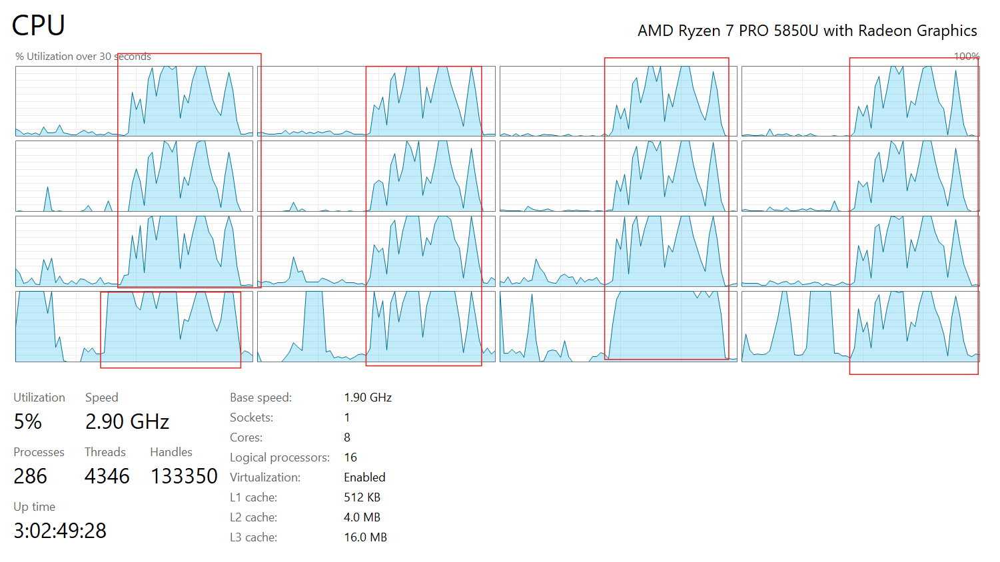
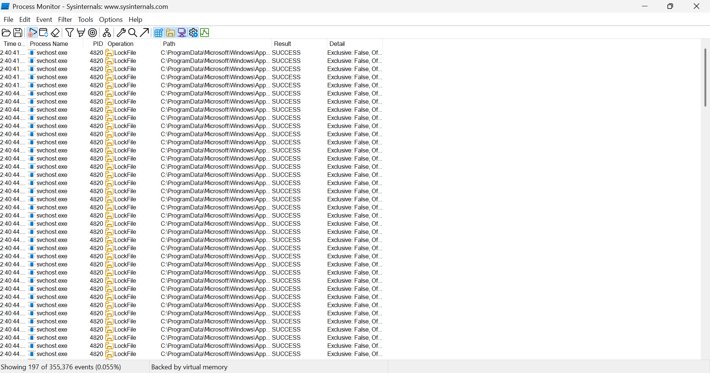
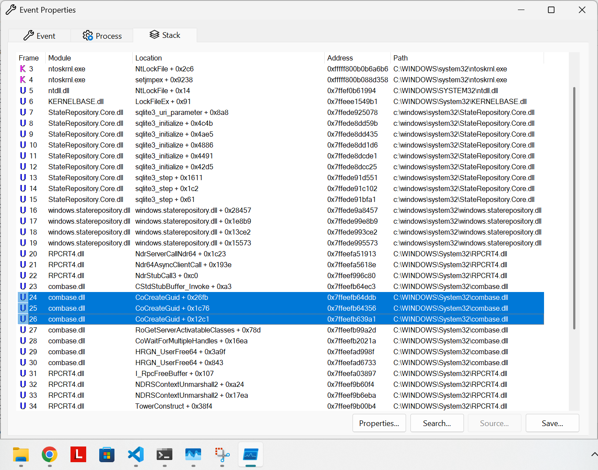

[](https://doi.org/10.5281/zenodo.14697927)

# WinTCacheMulti: An Attempt to Parallelize Thumbnail Extraction in Windows File Explorer

Windows remains the world's most widely used desktop operating system, and Windows File Explorer is one of the most critical
software tools. The Windows File Explorer enables users to browse and preview the files stored on their computers with a
dedicated user interface. Despite its essential role, starting from Windows 7, the file File Explorer had significant flaws
with its software design, especially regarding thumbnail extraction for media previews from directories with many files. The
performance bottleneck becomes especially evident when the directory includes video files, in which case the thumbnail
extraction is considerably slower and is always executed sequentially. Oftentimes, users are frustrated by thumbnail issues
and try to fix this problem by browsing online forums, where the most common answer is to clear the caches or restart their
systems. Still, all this happens without a lasting fix. Despite advancements in multi-core processors, Windows processes
thumbnail generation sequentially, not taking advantage of modern CPU capabilities. Given the likelihood of working with
Windows-based systems, there is a substantial opportunity to boost thumbnail loading speeds by taking full advantage of the
multi-core architecture of modern CPUs.

> - [Does the Windows File Explorer use parallelization for thumbnail extraction?](https://answers.microsoft.com/en-us/windows/forum/all/does-the-windows-file-explorer-use-parallelization/a95ad971-04e4-4dd2-a53d-d712669f9973)
> - [Windows Explorer slow thumbnail creation/processing](https://www.reddit.com/r/Windows11/comments/15jmukz/windows_explorer_slow_thumbnail_creationprocessing/)

`WinTCacheMulti` was an experiment that aimed to implement a multithreaded approach for
thumbnail extraction on Windows-based systems. The goal of this project was to optimize the
performance of Windows File Explorer's thumbnail extraction mechanism, which [historically has
relied on sequential processing](https://answers.microsoft.com/en-us/windows/forum/all/does-the-windows-file-explorer-use-parallelization/a95ad971-04e4-4dd2-a53d-d712669f9973).
Using a combination of Rust and C++, I created a command line interface (CLI), which
would extract the thumbnails of all the files in a given directory.

Despite extensive experimentation, the project ultimately concluded that **Windows _might be imposing_ file locks on the
thumbnail database**, severely limiting the effectiveness of a multithreaded approach. This implementation worked by
making direct calls to the following Windows system functions using a foreign function interface (FFI) wrapper layer from
Rust:

- [`SHCreateItemFromParsingName`](https://learn.microsoft.com/en-us/windows/win32/api/shobjidl_core/nf-shobjidl_core-shcreateitemfromparsingname) - For retrieving shell file handlers from the provided pathnames
- [`CoCreateInstance`](https://learn.microsoft.com/en-us/windows/win32/api/combaseapi/nf-combaseapi-cocreateinstance) - For creating objects defined in the Windows Component Object Model (COM), for a class associated with a predefined CLSID
- [`IThumbnailCache::GetThumbnail`](https://learn.microsoft.com/en-us/windows/win32/api/thumbcache/nf-thumbcache-ithumbnailcache-getthumbnail) - For getting or extracting a cached thumbnail for a given Shell item

## The Core Problem

After going through different implementations and testing, one issue in particular stood out
during the testing phase. In the latest implementation of [`wrapper.cpp`](./external/wrapper.cpp),
we initialize a separate `IThumbnailCache` as follows on each function call for extracting the thumbnail
of a single file:

```cpp
...
  // Code taken and adapted from the following StackOverflow thread
  // https://stackoverflow.com/q/20949827
  IThumbnailCache* cache = nullptr;
  code = CoCreateInstance(
    CLSID_LocalThumbnailCache, nullptr, CLSCTX_INPROC, IID_PPV_ARGS(&cache));
  HANDLE_ERROR(code);

  // Instructing Windows to extract the thumbnail of the provided entry in the
  // filesystem and making writing it to the local thumbnail cache.
  // https://learn.microsoft.com/en-us/windows/win32/api/thumbcache/nf-thumbcache-ithumbnailprovider-getthumbnail
  code = cache->GetThumbnail(
    entry,
    // Both WinThumbsPreloader and WinThumbsPreloader-V2 use 128x128 resolution
    128,
    // https://learn.microsoft.com/en-us/windows/win32/api/thumbcache/ne-thumbcache-wts_flags
    flags,
    nullptr, // Optionally, provide a bitmap for storing the thumbnail
    nullptr,
    nullptr);
  HANDLE_ERROR(code);
```

This works fine when the cache object is initialized **in the same thread where the function is being called**.
However, naturally, my intuition suggested also try to implement a "shared" cache object so that
multiple threads can have access to the `cache` variable and make parallel calls to the `GetThumbnail()`
method; however, this proved to be ineffective, as I ended up constantly getting `0x000005A4` errors, which
from the [Windows Error Codes](https://knowledge.broadcom.com/external/article/152212/error-codes-list-for-microsoft-technolog.html) meant that the thread identifier is invalid. The origin
of the error is a call to the `GetThumbnail()`, which helps us understand that the actual error comes
from [the Windows Component Object Model (COM)](https://www.cs.umd.edu/~pugh/com/).

### Reproducing the Error `0x000005A4`

To reproduce the error `0x000005A4` on your local machine, you can compile the following C++ code
using any Windows-compatible C++ compiler.

[Click here](./docs/code/reproduce_error.cpp) to view the C++ code used to reproduce the error `0x000005A4`.

Compile using LLVM clang. Note that the example assumes that you are compiling on a Windows-based machine.
Windows-specific functions are available only on Windows. **Compiling on other systems like Linux will fail**.

```powershell
clang++ -O3 -std=c++20 -fsave-optimization-record ./docs/reproduce_error.cpp -o ./win_tcache_multi.exe
# Assuming that you have a folder titled `images` in the same folder as your C++ source
.\win_tcache_multi.exe .\images
```

Expected output:

```text
...
error: get_thumbnail_from_path:99 Invalid thread identifier.
error: get_thumbnail_from_path:99 Invalid thread identifier.
error: get_thumbnail_from_path:99 Invalid thread identifier.
error: get_thumbnail_from_path:99 Invalid thread identifier.
error: get_thumbnail_from_path:99 Invalid thread identifier.
error: get_thumbnail_from_path:99 Invalid thread identifier.
error: get_thumbnail_from_path:99 Invalid thread identifier.
error: get_thumbnail_from_path:99 Invalid thread identifier.
error: get_thumbnail_from_path:99 Invalid thread identifier.
error: get_thumbnail_from_path:99 Invalid thread identifier.
error: get_thumbnail_from_path:99 Invalid thread identifier.
error: get_thumbnail_from_path:99 Invalid thread identifier.
error: get_thumbnail_from_path:99 Invalid thread identifier.
error: get_thumbnail_from_path:99 Invalid thread identifier.
error: get_thumbnail_from_path:99 Invalid thread identifier.
...
```

This error helped me to assume that `CLSID_LocalThumbnailCache` is only designed to be accessed
from [single-thread apartments](https://learn.microsoft.com/en-us/windows/win32/com/single-threaded-apartments) (STAs) and
that any subsequent requests to access the cache from multiple threads will be left unfulfilled. In turn, this might imply
that this mechanism has been put into place to prevent any sort of file corruption that might occur when writing to the
thumbnail cache from different threads, which led me to believe that Windows creates exclusive file locks when interacting
with the local thumbnail cache. This was evident from the similar performance benchmarks of the single-threaded and multithreaded approaches.

## Benchmarks

To understand the difference in performance (and whether there _actually was_ any difference),
I ran through a suite of 2 benchmarks, one for testing the **single-threaded** performance and the other
one for **multithreaded**. Check out [xthread.rs](./benches/xthread.rs). The benchmarks have been performed on a Lenovo
ThinkPad P14s 2nd generation laptop with the following specifications:

- CPU: AMD Ryzen 7 PRO 5850U (8 cores)
- RAM: 32GB, DDR4 (1200 MHz)
- ROM: 512GB SSD (SKHynix_HFS512GDE9X081N)

The dataset I used for benchmarking contained 100 videos of 4K resolution, taking up approximately 1GB of space in total. The benchmark ran for 10 iterations, although previously 100 iterations were tested as well with no significant difference. The benchmarks produced comparable results with a very minor difference in processing time.

> Note: Benchmarks have been computed using the [criterion](https://github.com/bheisler/criterion.rs) library.

| Metric | Multi-threaded | Single-threaded |
| ------ | -------------- | --------------  |
|       Mean (s) | 15.8900|  16.67300|
|  Std. Dev. (s) |  1.8415|   0.59600|
|     Median (s) | 15.9220|  16.39200|
|        MAD (s) |  1.1442|   0.17474|

You can run the benchmarking suite yourself by running the following command in the terminal:

```powershell
cargo bench
```

> This assumes that you have the Rust toolchain installed. If not, install it from <https://rust-lang.org/>.

According to the benchmarks, the performance difference is about 1 second. This number stabilizes even more
as we increase the number of iterations in the benchmark's configuration. After investigating this
further and mapping through different components of Windows, I came up with the following very high-level diagram
of what I assume happens:


Initially, we spawned many blocking tasks using Rust's Tokio runtime. Using the FFI bindings, the Rust code makes calls
to the C++ code, which calls the underlying Windows APIs. The Windows APIs acquire a shell item and access to the
local thumbnail cache, which, once again, cannot be shared between unique threads. While a single thread processes
the thumbnail extraction, the rest of the threads wait until the thumbnail cache resource on Windows becomes
available. The fact that other threads are waiting can also be observed by looking into the _CPU utilization_ metric
in the Windows task manager:



While multithreading aimed to improve performance, threads consumed CPU cycles due to busy-waiting. This behavior occurred due to file locks imposed by Windows, preventing concurrent access to the thumbnail cache. Busy-waiting is when a  process waits and continuously checks for the condition to be satisfied before executing. In our case, the odds are high that a lock in the OS prevented the CPU from
doing the work in parallel. To make sure that locking was occurring, I analyzed what happens when I run
WinTCacheMulti using [ProcMon from Windows Sysinternals](https://learn.microsoft.com/en-us/sysinternals/downloads/procmon).
Surely enough, immediately after running the program, a lot (at least 50) of file locks were queued in the process monitor,
specifically on a file called `C:\ProgramData\Microsoft\Windows\AppRepository\StateRepository-Machine.srd-shm`. After some research, I found that the file is a shared memory file associated with the `StateRepository-Machine.srd` SQLite database.
In SQLite, shared memory files (.srd-shm) manage concurrent access to the database, facilitating communication
between different processes or threads accessing the database simultaneously. Additionally, here is a screenshot from ProcMon
after starting the program execution:



> For reference, see: <https://www.tmurgent.com/TmBlog/?p=3618&utm_source=chatgpt.com>

The `svchost.exe` created many non-exclusive file locks on the shared memory file. In my understanding, there might be a "virtual" file locking mechanism, which doesn't directly lock the thumbnail caches at their designated locations but instead goes through the `svchost.exe` -> `Component Object Model (COM)` and only then to the actual thumbnail cache database.

In the following image, it is evident that a new GUID is being created by the combase.dll, which is the library of the Component Object Model (COM):



It is unclear why Microsoft would be forced into using a single-threaded approach. It is well-known that SQLite natively supports multi-threaded reads and writes from their documentation.

> See: <https://www.sqlite.org/threadsafe.html#:~:text=Multi%2Dthread.,threads%20at%20the%20same%20time>.

### Benchmark Summary

- Multithreaded performance was marginally better (~4.7%), but high CPU utilization indicated threads were waiting on file locks
- Lock contention in the thumbnail database nullified parallel processing benefits

## Building and Running From Source

If you want to build and run WinTCacheMulti from source, you can run the following
command. The example assumes that you have the Rust toolchain installed:

```powershell
# For multi-threaded
cargo run --release -- --dir ./images
# For single-threaded
cargo run --release -- --st --dir ./images
```

## Conclusion

While I initially aimed to develop an embarrassingly parallel approach to "fix" the Windows File Explorer's thumbnail extraction process, I managed to go down deeper the rabbit hole and find out that this is technically impossible to do due to the way that Windows handles and uses SQLite internally.

Through extensive experimentation, it became evident that Windows imposes strict file locks on the thumbnail cache (`thumbcache_*` files) to ensure data integrity and (_presumably_) prevent corruption during concurrent read/write operations. Moreover, the reliance on the Windows Component Object Model (COM) and its threading model (Single-Threaded Apartments for the thumbnail cache) further compounds the challenge. My original attempts to share the IThumbnailCache object across multiple threads consistently resulted in errors (0x000005A4: Invalid thread identifier), highlighting inherent limitations in the system's design.

Despite the lack of success in achieving full parallelization, this project provided valuable insights into:

1. **How Windows internally manages the thumbnail cache**.

2. **The design choices and trade-offs made to prioritize stability and integrity over performance in the File Explorer**.

3. **The challenges of working with system-level APIs and components not designed for concurrent access**.

## Acknowledgements

I would like to express my gratitude to [Ash Vardanian](https://www.linkedin.com/in/ashvardanian/), Founder of Unum Cloud, for his willingness to share his expertise in low-level software design. I occasionally reached out to him with questions about efficient design principles, and he was always available to provide thoughtful guidance. While his insights were valuable to my understanding, any mistakes or inaccuracies in this research are solely my own.
Additionally, I would like to thank my program chair [Dr. Hayk Nersisyan](https://people.aua.am/team_member/hayk-nersisyan/) for encouraging me not to give up since I didn't get the results I expected. Lastly, I acknowledge ChatGPT for helping me paraphrase a few of the sentences in the final sections of this project.

## Citing

See [CITATION.cff](./CITATION.cff).
